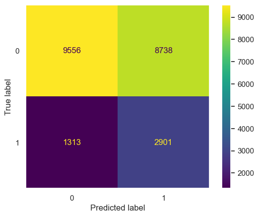
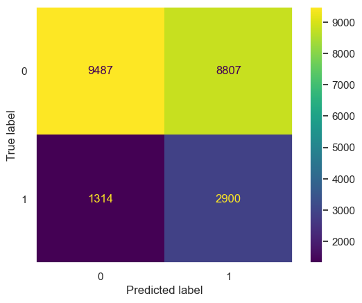

# Model selection
- As mentioned on part 7 of the "exploration.ipynb": "the model to be productive must be the one that is trained with the top 10 features and class balancing".
- The last statement can be confirmed by looking at the confusion matrixes as well as f1-scores in classification reports.
- Considering this, a comparison of confusion matrixes and classification reports metrics must be done.

## Confusion matrix comparison
- XGBoost with feature importance and class balancing.
    - 

- Logistic Regression with feature importance and class balancing.
    - 

### Analysis
- Considering the previous confusion matrixes, the XGBoost classifier has better accuracy for this task. This observation can be further confirmed by reviewing metrics from the classification reports.

## Classification reports metrics comparison
- XGBoost with feature importance and class balancing

    |              | precision | recall | f1-score | support |
    | ---          | ---       | ---    | ---      |     --- |
    |  0           | 0.88      | 0.52   | 0.66     |  18294  |
    |  1           | 0.25      | 0.69   | 0.37     |  4214   |
    | accuracy     |           |        |   0.55   |   22508 |
    | macro avg    |   0.56    |  0.61  |    0.51  |   22508 |
    | weighted avg |   0.76    |   0.55 |   0.60   |   22508 |

- Logistic Regression with feature importance and class balancing

    |              | precision | recall | f1-score | support |
    | ---          | ---       | ---    | ---      |     --- |
    |  0           | 0.88      | 0.52   | 0.65     |  18294  |
    |  1           | 0.25      | 0.69   | 0.36     |  4214   |
    | accuracy     |           |        |   0.55   |   22508 |
    | macro avg    |   0.56    |  0.60  |    0.51  |   22508 |
    | weighted avg |   0.76    |   0.55 |   0.60   |   22508 |

### Analysis
- Most metrics for XGBoost and Logistic Regression are the same when trained with feature importance and class balancing. The determining factor for knowing the best one is the f1-score for both reports. 
- An f1-score is better the closer it gets to be equal to 1.
- Considering this, the XGBoost Classifier is the best for this task, since its f1-scores are 0.66 and 0.37, both 1/100th higher than the Logistic Regression model.

# Deployment
- Following recommendations, GCP was used to deploy the API.
- Considering the existence of a *Dockerfile* on the provided challenge, deployment is made using a container.
- Since there is no need for Kubernetes features, Google Cloud Run is used for deployment of the API, instead of Google Kubernetes Engine.
- As requested on *Part IV*, CI and CD (with GitHub Actions) are used for testing and deployment, respectively.